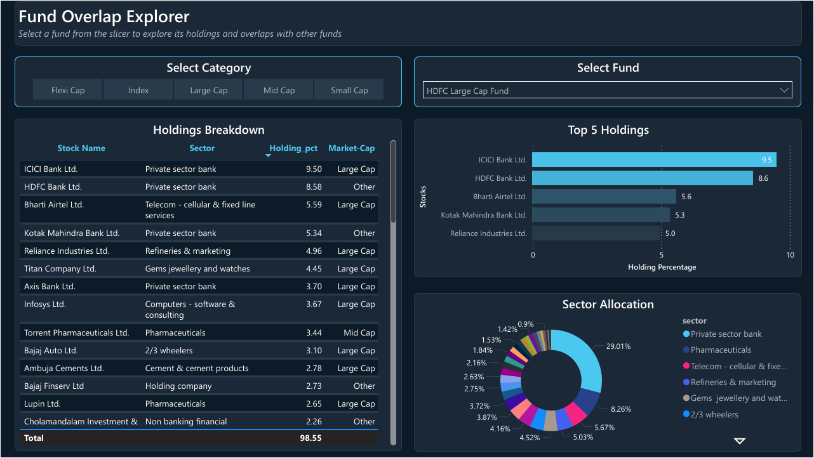
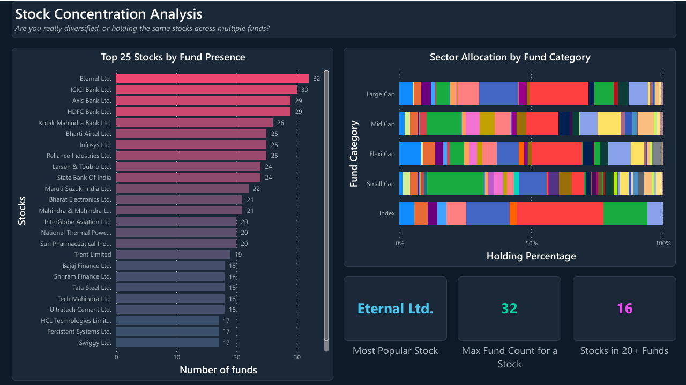
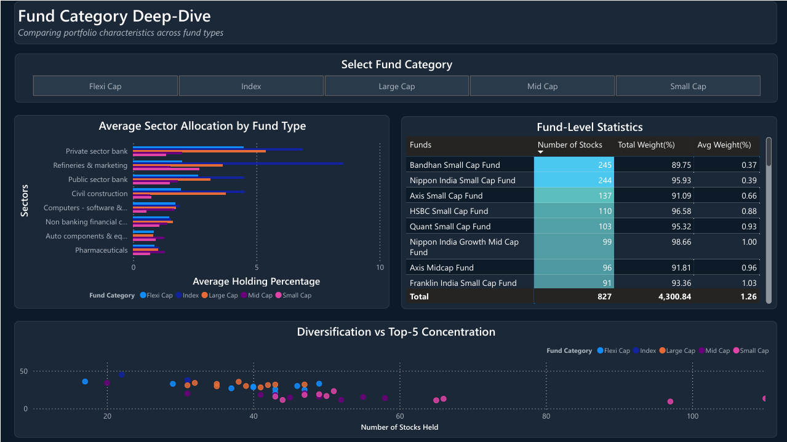

# Indian Mutual Fund Portfolio Overlap Analysis

End-to-end analysis of portfolio overlap and concentration risk across **45 top Indian equity mutual funds** — from raw scraping to SQL analysis to an interactive Power BI dashboard.

Millions of Indian investors hold 3–5 mutual funds thinking they are diversified, but most funds hold the same stocks. This project quantifies that hidden overlap and surfaces the structural reasons behind it.

---

## What's in this repo

This repo combines two previously separate projects into one place:

| Layer | What it does | Folder |
|-------|--------------|--------|
| **SQL Analysis** | 19 SQL queries on a SQLite database — overlap, concentration, sector exposure, optimal portfolio construction. Built in a Jupyter notebook. | [`analysis/`](analysis/) |
| **Power BI Dashboard** | 4-page interactive dashboard with DAX measures, cross-filtered visuals, and a diversification scatter plot. | [`dashboard/`](dashboard/) |
| **Data** | Scraped holdings (CSV), SQLite database, and fund URL reference. | [`data/`](data/) |

---

## Dataset

- **Source:** Scraped from [Moneycontrol.com](https://www.moneycontrol.com) (publicly available portfolio holdings) using Python + BeautifulSoup
- **Funds Analyzed:** 45 (top by AUM across categories)
  - Large Cap: 10
  - Mid Cap: 10
  - Small Cap: 10
  - Flexi Cap: 10
  - Index Funds: 5
- **Total Holdings:** 3,421 stock entries across 827 unique stocks
- **Data as of:** February/March 2026

---

## Key Findings

1. **Index funds share ~100% overlap** — holding multiple Nifty 50 funds is pointless.
2. **Large cap funds overlap 57% on average** — SEBI's 80% mandate in ~100 stocks leaves little room for differentiation.
3. **Small cap funds are the most unique** — only 12% average overlap with 1000+ stocks to choose from.
4. **ICICI Bank appears in 30/45 funds, HDFC Bank in 29/45** — massive hidden banking concentration.
5. **Eternal Ltd. (Zomato) is the most widely held stock** — present in 32 out of 45 funds.
6. **Parag Parikh Flexi Cap is the most unique fund** — foreign holdings ensure near-zero overlap with domestic funds.
7. **Best diversification combo:** Small Cap + Large Cap — only 4–5% overlap.
8. **Flexi Cap funds aren't really "flexi"** — 7.5× more weight in large caps vs small caps.
9. **Concentration varies wildly** — HDFC Sensex needs just 6 stocks to reach 50% of portfolio; Nippon Small Cap needs 59.
10. **Index funds have zero small cap exposure** — investors relying solely on index funds completely miss the small cap segment.

---

## SQL Analysis (`analysis/`)

19 SQL queries covering:

- Portfolio overlap between fund pairs (weighted overlap using MIN-weight formula)
- Most crowded stocks and sectors across all funds
- Category-wise overlap comparison (Large vs Mid vs Small vs Flexi vs Index)
- Cross-category diversification analysis
- Fund concentration and diversification scoring
- Optimal 5-fund portfolio recommendation
- Hidden-gem stocks with high conviction but low popularity
- Market cap distribution across fund categories
- Window functions (RANK, cumulative SUM) for holdings ranking and concentration

Open [`analysis/mutual_fund_overlap_analysis.ipynb`](analysis/mutual_fund_overlap_analysis.ipynb) in Jupyter to reproduce.

---

## Power BI Dashboard (`dashboard/`)

Four interactive pages. Screenshots below; the full `.pbix` file is in [`dashboard/MF_Overlap_Dashboard.pbix`](dashboard/MF_Overlap_Dashboard.pbix) and a static PDF export in [`dashboard/dashboard_preview.pdf`](dashboard/dashboard_preview.pdf).

### Page 1 — Overview


- 4 KPI cards: Total Funds (45), Unique Stocks (827), Total Holdings (3,421), Avg Holdings/Fund (76)
- Top 10 funds by number of stocks held
- Holdings distribution donut by category (Small Cap dominates at 36.33%)
- Sector concentration treemap — Private Sector Banking and IT dominate

### Page 2 — Overlap Explorer (Interactive)


- Category slicer (horizontal tile buttons) and fund dropdown
- Holdings table with sector, holding %, market cap
- Top 5 holdings bar with conditional formatting
- Sector allocation donut for the selected fund
- All visuals cross-filter instantly

### Page 3 — Stock Concentration


- Top 25 most commonly held stocks (Eternal in 32/45, ICICI in 30, Axis & HDFC in 29 each)
- 100% stacked sector allocation by category
- Insight cards: most popular stock, max fund presence, stocks appearing in 20+ funds (16 stocks)

### Page 4 — Category Deep-Dive


- Category slicer for head-to-head comparison
- Grouped bar of average sector allocation by fund type
- Fund stats matrix with heatmap conditional formatting
- **Diversification vs Concentration scatter plot** — x: number of stocks held, y: top-5 holdings weight. Reveals that holding many stocks doesn't guarantee diversification.

### DAX Measures

| Measure | Formula | Purpose |
|---------|---------|---------|
| Avg Holdings Per Fund | `DIVIDE(COUNTROWS(table), DISTINCTCOUNT(table[fund_name]))` | KPI card (Page 1) |
| Stock Popularity | `CALCULATE(DISTINCTCOUNT(table[fund_name]))` | Fund presence count |
| Most Held Stock | `TOPN(1, VALUES(table[stock_name]), ...)` | Insight card (Page 3) |
| Max Fund Presence | `MAXX(VALUES(table[stock_name]), ...)` | Insight card (Page 3) |
| Stocks In 20+ Funds | `COUNTROWS(FILTER(SUMMARIZE(...), [fc] >= 20))` | Insight card (Page 3) |
| Stock Count | `DISTINCTCOUNT(table[stock_name])` | Scatter X-axis |
| Top5 Concentration | `SUMX(TOPN(5, SUMMARIZE(...)), [hp])` | Scatter Y-axis |

---

## Project Structure

```
.
├── analysis/
│   └── mutual_fund_overlap_analysis.ipynb   # Main SQL analysis notebook
├── dashboard/
│   ├── MF_Overlap_Dashboard.pbix            # Power BI dashboard
│   ├── dashboard_preview.pdf                # Static PDF export
│   └── screenshots/                         # Page previews
├── data/
│   ├── mutual_fund_holdings.csv             # Raw scraped holdings
│   ├── mutual_fund_holdings_dashboard.csv   # Dashboard-ready dataset
│   ├── mutual_fund_overlap.db               # SQLite database
│   └── funds_list.json                      # Fund URL reference
└── README.md
```

---

## How to Run

### SQL Analysis
1. Clone this repo.
2. Open [`analysis/mutual_fund_overlap_analysis.ipynb`](analysis/mutual_fund_overlap_analysis.ipynb) in Jupyter.
3. Run all cells — the notebook scrapes fresh data, builds the database, and runs all 19 analyses.
4. Requires: `pip install requests beautifulsoup4 pandas`

### Power BI Dashboard
1. Download [`dashboard/MF_Overlap_Dashboard.pbix`](dashboard/MF_Overlap_Dashboard.pbix).
2. Open in [Power BI Desktop](https://www.microsoft.com/en-us/power-platform/products/power-bi/desktop) (free, Windows).
3. If you only want a static view, open [`dashboard/dashboard_preview.pdf`](dashboard/dashboard_preview.pdf).

---

## Tech Stack

- **Python** — `requests`, `BeautifulSoup` (scraping), `pandas` (cleaning)
- **SQL (SQLite)** — JOINs, CTEs, window functions, self-joins, aggregations
- **Power BI Desktop** — visuals, slicers, cross-filters
- **DAX** — custom measures for KPIs and scatter metrics

---

## Limitations

- Data scraped at a single point in time — holdings change monthly with portfolio rebalancing.
- Equity holdings only — debt, cash, and foreign equity excluded.
- Moneycontrol data may have minor discrepancies vs official AMC disclosures.
- Fund category classification is based on fund name keywords, not official SEBI categorization.
- "Other" market cap bucket includes foreign and uncategorized stocks.
- The Power BI dashboard requires Power BI Desktop (Windows) to interact with — PDF provided otherwise.

---

## Author

**Daksh Malhotra**
B.Tech Engineering Physics, Delhi Technological University
