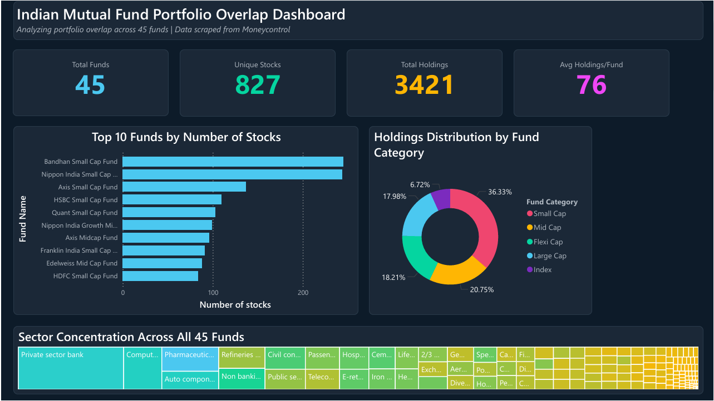
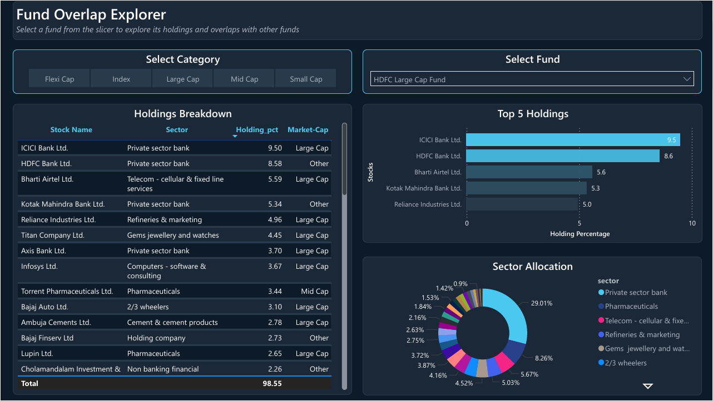
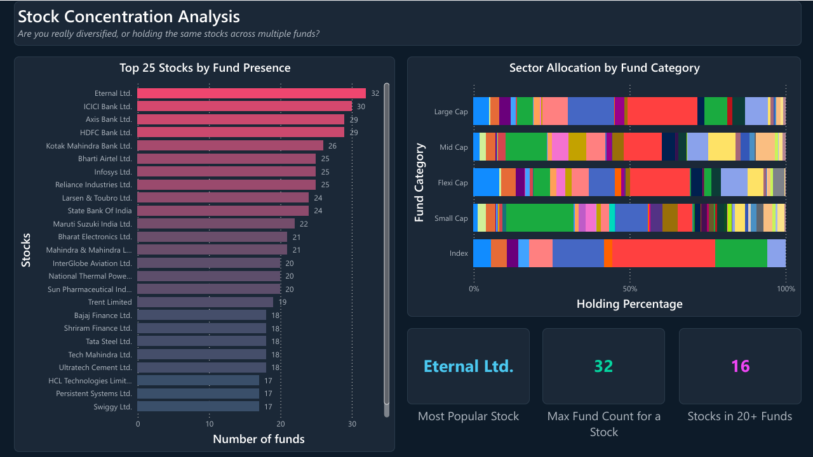
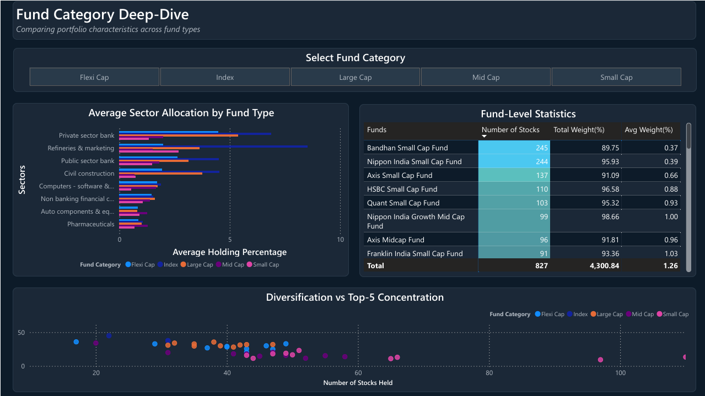

# Indian Mutual Fund Portfolio Overlap Analysis

End-to-end analysis of portfolio overlap and concentration risk across **45 top Indian equity
mutual funds** — from raw scraping to pandas EDA, SQL analysis, an interactive Power BI
dashboard, and a REST API that scores any fund portfolio for diversification.

Millions of Indian investors hold 3–5 mutual funds thinking they are diversified, but most
funds hold the same stocks. This project quantifies that hidden overlap and surfaces the
structural reasons behind it.

---

## What's in this repo

| Layer | What it does | Folder |
|-------|--------------|--------|
| **Python EDA** | pandas + seaborn exploration: data quality, the 45×45 overlap matrix, sector tilts, breadth-vs-concentration. | [`analysis/eda.ipynb`](analysis/eda.ipynb) |
| **SQL Analysis** | 19 SQL queries on a SQLite database — overlap, concentration, sector exposure, optimal portfolio construction. | [`analysis/mutual_fund_overlap_analysis.ipynb`](analysis/mutual_fund_overlap_analysis.ipynb) |
| **Power BI Dashboard** | 4-page interactive dashboard with DAX measures, cross-filtered visuals, and a diversification scatter plot. | [`dashboard/`](dashboard/) |
| **REST API** | FastAPI service: portfolio X-ray, 0–100 diversification score, smart-switch recommendations, JWT auth, saved portfolios. | [`api/`](api/) |
| **Data** | Scraped holdings (CSV), SQLite database, and fund URL reference. | [`data/`](data/) |

---

## Dataset

- **Source:** Scraped from [Moneycontrol.com](https://www.moneycontrol.com) (publicly available portfolio holdings) using Python + BeautifulSoup
- **Funds Analyzed:** 45 (top by AUM across categories)
  - Large Cap: 10 | Mid Cap: 10 | Small Cap: 10 | Flexi Cap: 10 | Index: 5
- **Total Holdings:** 3,421 stock entries across 827 unique stocks
- **Data as of:** February/March 2026

---

## Key Findings

1. **Index funds share ~100% overlap** — holding multiple Nifty 50 funds is pointless.
2. **Large cap funds overlap 57% on average** — SEBI's 80% mandate in ~100 stocks leaves little room for differentiation.
3. **Small cap funds are the most unique** — only 12% average overlap with 1000+ stocks to choose from.
4. **ICICI Bank appears in 30/45 funds, HDFC Bank in 29/45** — massive hidden banking concentration.
5. **Eternal Ltd. (Zomato) is the most widely held stock** — present in 32 out of 45 funds.
6. **But crowding is asymmetric** — ~60% of the 827 stocks are held by exactly one fund; overlap is a large-cap phenomenon.
7. **Parag Parikh Flexi Cap is the most unique fund** — foreign holdings ensure near-zero overlap with domestic funds.
8. **Best diversification combos:** mixing across categories drops overlap to 4–5% — Index + Mid Cap is lowest at 4.3%, with Flexi Cap + Small Cap (4.9%) and Large Cap + Small Cap (5.1%) close behind.
9. **Flexi Cap funds aren't really "flexi"** — 7.5× more weight in large caps vs small caps.
10. **Breadth is not diversification** — several funds hold 60+ stocks while parking 40%+ of the portfolio in their top 5 bets.

---

## Python EDA (`analysis/eda.ipynb`)

pandas + seaborn exploration that runs before any SQL:

- Data quality: nulls, duplicates, per-fund equity coverage (85–100% for most funds)
- Portfolio breadth by category (index funds hold ~50 stocks, small caps up to 100+)
- Holding weight distributions and the 10 biggest single positions
- Stock popularity: crowded large caps vs the ~60% of stocks held by only one fund
- The full 45×45 weighted overlap matrix, computed vectorized in NumPy, plus the
  category-level average overlap heatmap
- Sector tilts per category and the breadth-vs-concentration scatter

## SQL Analysis (`analysis/mutual_fund_overlap_analysis.ipynb`)

19 SQL queries covering:

- Portfolio overlap between fund pairs (weighted overlap using MIN-weight formula)
- Most crowded stocks and sectors across all funds
- Category-wise overlap comparison (Large vs Mid vs Small vs Flexi vs Index)
- Cross-category diversification analysis
- Fund concentration and diversification scoring
- Optimal 5-fund portfolio recommendation
- Hidden-gem stocks with high conviction but low popularity
- Window functions (RANK, cumulative SUM) for holdings ranking and concentration

## Power BI Dashboard (`dashboard/`)

Four interactive pages. Screenshots below; the full `.pbix` file is in
[`dashboard/MF_Overlap_Dashboard.pbix`](dashboard/MF_Overlap_Dashboard.pbix) and a static
PDF export in [`dashboard/dashboard_preview.pdf`](dashboard/dashboard_preview.pdf).

### Page 1 — Overview


- 4 KPI cards: Total Funds (45), Unique Stocks (827), Total Holdings (3,421), Avg Holdings/Fund (76)
- Top 10 funds by number of stocks held
- Holdings distribution donut by category (Small Cap dominates at 36.33%)
- Sector concentration treemap — Private Sector Banking and IT dominate

### Page 2 — Overlap Explorer (Interactive)


- Category slicer (horizontal tile buttons) and fund dropdown
- Holdings table with sector, holding %, market cap
- Top 5 holdings bar with conditional formatting
- Sector allocation donut for the selected fund
- All visuals cross-filter instantly

### Page 3 — Stock Concentration


- Top 25 most commonly held stocks (Eternal in 32/45, ICICI in 30, Axis & HDFC in 29 each)
- 100% stacked sector allocation by category
- Insight cards: most popular stock, max fund presence, stocks appearing in 20+ funds (16 stocks)

### Page 4 — Category Deep-Dive


- Category slicer for head-to-head comparison
- Grouped bar of average sector allocation by fund type
- Fund stats matrix with heatmap conditional formatting
- **Diversification vs Concentration scatter plot** — x: number of stocks held, y: top-5 holdings weight

### DAX Measures

| Measure | Formula | Purpose |
|---------|---------|---------|
| Avg Holdings Per Fund | `DIVIDE(COUNTROWS(table), DISTINCTCOUNT(table[fund_name]))` | KPI card (Page 1) |
| Stock Popularity | `CALCULATE(DISTINCTCOUNT(table[fund_name]))` | Fund presence count |
| Most Held Stock | `TOPN(1, VALUES(table[stock_name]), ...)` | Insight card (Page 3) |
| Max Fund Presence | `MAXX(VALUES(table[stock_name]), ...)` | Insight card (Page 3) |
| Stocks In 20+ Funds | `COUNTROWS(FILTER(SUMMARIZE(...), [fc] >= 20))` | Insight card (Page 3) |
| Stock Count | `DISTINCTCOUNT(table[stock_name])` | Scatter X-axis |
| Top5 Concentration | `SUMX(TOPN(5, SUMMARIZE(...)), [hp])` | Scatter Y-axis |

## REST API (`api/`)

FastAPI service over the same dataset. Runs on SQLite out of the box (no setup);
point `DATABASE_URL` at MySQL for a server database.

- `GET /api/funds/` — list/search funds; `GET /api/funds/{id}` — fund with holdings
- `GET /api/analysis/overlap?fund1_id=X&fund2_id=Y` — weighted overlap between two funds
- `GET /api/analysis/most-held-stocks`, `GET /api/analysis/sectors` — universe-level concentration
- `POST /api/portfolio/xray` — true exposure of a multi-fund portfolio: duplicate holdings, sector and market-cap breakdown
- `POST /api/portfolio/score` — 0–100 diversification score (penalties for overlap, concentration, sector dominance; bonus for category mix)
- `POST /api/portfolio/smart-switch` — finds the weakest fund and recommends replacements
- `POST /api/portfolio/recommend` — SIP allocation by risk profile
- `POST /api/auth/signup`, `/login` — JWT auth (bcrypt-hashed passwords); save/retrieve/delete portfolios on protected routes

Scoring: starts at 100 — overlap penalty (0–30), concentration penalty (0–25), sector
penalty (0–25), category-mix bonus (0–20), clamped to 0–100. Three large-cap funds
typically score in the 40s; a Large + Mid + Small mix lands in the 80s.

```bash
cd api
pip install -r requirements.txt
python seed.py                          # loads data/mutual_fund_holdings.csv into SQLite
python -m uvicorn app.main:app --port 8080
# interactive docs: http://127.0.0.1:8080/docs
python -m pytest tests/                 # 7 tests: endpoints, scoring sanity, auth flow
```

---

## Project Structure

```
.
├── analysis/
│   ├── eda.ipynb                            # pandas/seaborn EDA
│   └── mutual_fund_overlap_analysis.ipynb   # SQL analysis notebook
├── api/
│   ├── app/                                 # FastAPI app (routers, models, auth)
│   ├── tests/                               # pytest suite
│   ├── seed.py                              # CSV -> database loader
│   └── requirements.txt
├── dashboard/
│   ├── MF_Overlap_Dashboard.pbix            # Power BI dashboard
│   ├── dashboard_preview.pdf                # Static PDF export
│   └── screenshots/
├── data/
│   ├── mutual_fund_holdings.csv             # Raw scraped holdings
│   ├── mutual_fund_holdings_dashboard.csv   # Dashboard-ready dataset (adds fund_category)
│   ├── mutual_fund_overlap.db               # SQLite database (SQL notebook)
│   └── funds_list.json                      # Fund URL reference
└── README.md
```

---

## How to Run

**EDA:** open `analysis/eda.ipynb` in Jupyter and run all cells. Requires `pandas`, `seaborn`, `matplotlib`.

**SQL Analysis:** open `analysis/mutual_fund_overlap_analysis.ipynb` — the notebook scrapes fresh data, builds the database, and runs all 19 analyses. Requires `requests`, `beautifulsoup4`, `pandas`.

**Dashboard:** download `dashboard/MF_Overlap_Dashboard.pbix` and open in [Power BI Desktop](https://www.microsoft.com/en-us/power-platform/products/power-bi/desktop) (free, Windows). Static PDF included otherwise.

**API:** see the API section above.

---

## Tech Stack

- **Python** — pandas, NumPy, seaborn/matplotlib (EDA), requests + BeautifulSoup (scraping)
- **SQL (SQLite / MySQL)** — JOINs, CTEs, window functions, self-joins, aggregations
- **FastAPI** — REST API with SQLAlchemy ORM, Pydantic schemas, JWT auth, pytest
- **Power BI Desktop + DAX** — interactive dashboard

---

## Limitations

- Data scraped at a single point in time — holdings change monthly with portfolio rebalancing.
- Equity holdings only — debt, cash, and foreign equity excluded.
- Moneycontrol data may have minor discrepancies vs official AMC disclosures.
- Fund category classification is based on fund name keywords, not official SEBI categorization.
- The Power BI dashboard requires Power BI Desktop (Windows) to interact with — PDF provided otherwise.

---

## Author

**Daksh Malhotra**
B.Tech Engineering Physics, Delhi Technological University
